# 🚀 Demo: Workflow CI/CD con GitHub Copilot


En la presente demo, utilizaremos GitHub Copilot como asistente principal en la creación de un pipeline de CI/CD con GitHub Actions. Incluye las etapas de build, test y deploy de una aplicación Python-FastApi en Azure App Service. 
## 📌 Objetivos


- Usar GitHub Copilot para generar un workflow completo con GitHub Actions.
- Explorar las funcionalidades de GitHub Copilot en distintos entornos: IDE, línea de comandos y GitHub Web.
- Aprovechar prompts en lenguaje natural para resolver tareas técnicas sin conocimientos previos.
- Aumentar tu productividad automatizando procesos de build, test y deploy con ayuda de IA 🤖.

---
## 🛠️ Requisitos previos

- Cuenta de [GitHub](https://github.com/) con GitHub Copilot habilitado.
- Cuenta en [Azure](https://azure.microsoft.com/) con acceso a Azure App Service.
- Visual Studio Code instalado localmente o en GitHub Workspace.
- Extensiones de VSC:
    - [GitHub Copilot](https://marketplace.visualstudio.com/items?itemName=GitHub.copilot)
    - [Python](https://marketplace.visualstudio.com/items?itemName=ms-python.python)
    - [GitHub Copilot for Azure](https://marketplace.visualstudio.com/items?itemName=ms-azuretools.vscode-azure-github-copilot)    
- Clone del repositorio:

     ```bash
     git clone https://github.com/aravera-nubi/fastapi-copilot.git
     ```


## ⌨️ Paso 1:  Obtener una introducción al proyecto desde Copilot Chat
Luego de haber configurado nuestro entorno de desarrollo, usemos Copilot para aprender un poco sobre el proyecto.

1. Abre el proyecto, previamente clonado, en Visual Studio Code.

2. En la parte superior de VS Code, localiza y haz clic en el ícono de **Copilot** para abrir un panel de Copilot Chat.

   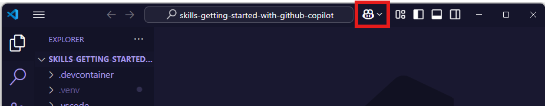


   > **Nota:** Si es la primera vez que usas GitHub Copilot, necesitarás iniciar sesión con tu cuenta de GitHub y aceptar los términos de uso para continuar.


3. Escribe el siguiente mensaje para pedirle a Copilot que te haga una introducción al proyecto:

   ```markdown
   @workspace Please briefly explain the structure of this project.
<details style="margin-left: 40px;">
<summary>Ejemplo de respuesta</summary>

   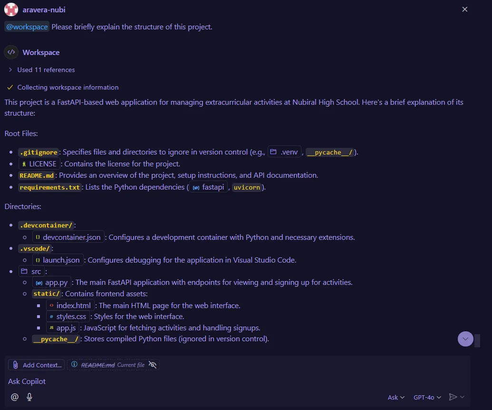

</details > 

4. Ahora que estamos un poco más familiarizados con el proyecto, vamos a ver cómo podemos usar Copilot para ejecutarlo localmente. Ingresa el siguiente mensaje en el chat para que Copilot te guíe:

   ```markdown
   @workspace Help me run the application locally by creating a virtual environment (.venv) and installing the dependencies. I'm using Git Bash on Windows.

<details style="margin-left: 40px;">
<summary>Ejemplo de respuesta</summary>

Colocar la imágen/ hacer referencia a la captura.

</details > 


##  Paso 2:  Usar GitHub Copilot desde la terminal de VS Code para crear una nueva rama
Ahora que tenemos el proyecto corriendo localmente, vamos a crear una nueva rama para trabajar en la implementación de un pipeline de CI/CD. Usaremos GitHub Copilot para ayudarnos a recordar los comandos de la terminal.

1. Crea una nueva rama para trabajar con workflows de GitHub Actions: En el panel inferior, selecciona la pestaña **Terminal**. En el lado derecho, haz clic en el signo más `+` para crear una nueva ventana de terminal.     
   

   > **Nota:** Si no ves el ícono de la terminal, puedes abrir una nueva terminal usando el atajo de teclado `Ctrl + Shift + \`` (windows) o `Cmd + Shift + \`` (mac).  
    
2. Dentro de la nueva ventana de terminal, usa el atajo de teclado `Ctrl + I` (windows) o `Cmd + I` (mac) para abrir el **Copilot's Terminal Inline Chat**.

   Escribe el siguiente prompt:

   ```markdown
   Hey copilot, how can I create and publish a new Git branch?


3. Copilot probablemente nos sugirió lo siguiente. En lugar de modificarlo manualmente, respondamos para decirle a Copilot que use un nombre en particular.

4. Ahora, presiona el botón **Run** para que Copilot lo ejecute por nosotros. No es necesario copiar y pegar.


##  Paso 3:  Crear carpeta y archivo .yml para el workflow con GitHub Actions

1. Usando Copilot chat:

   ```bash
   @workspace ¿What would be the first step to create a workflow with GitHub Actions?
   ```
   Copilot nos sugiere crear una carpeta `.github/workflows` y un archivo `main.yml` dentro de ella. Aceptamos la sugerencia y creamos la carpeta y el archivo.
      
   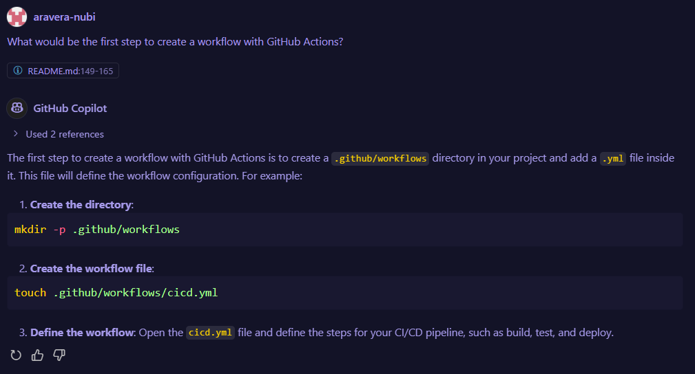

2. Abre el archivo recientemete creado cicd.yml.
3. Posiciona el cursor en la primera línea del archivo y presiona `Ctrl + I` (windows) o `Cmd + I` (mac) para abrir el **Copilot's Inline Chat**.
4. Escribe el siguiente mensaje para pedirle a Copilot que te ayude a compilar la solución con github actions:

   ```markdown
   Create a GitHub Actions workflow that builds this Python application.You should create and activate a virtual environment and Install dependencies from requirements.txt.
   ```

   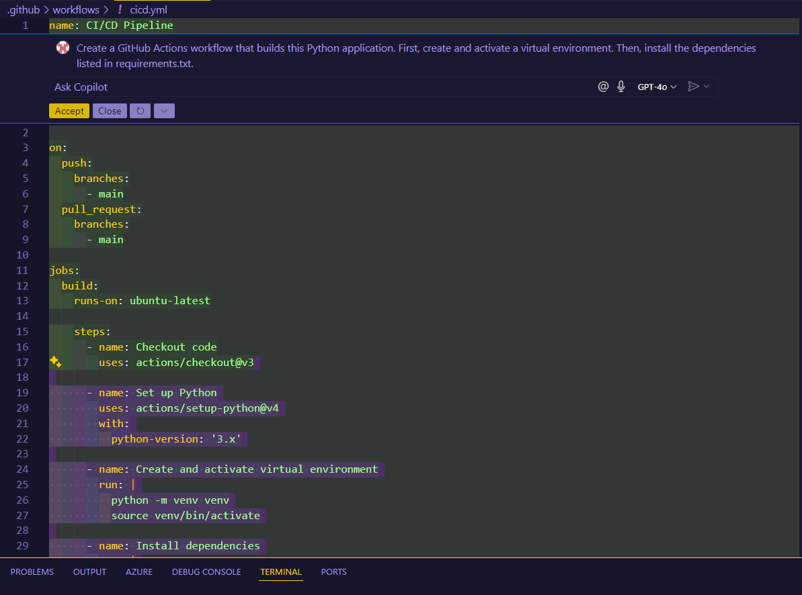

5. Copilot sugerirá el código para el workflow. Presiona el botón **Acept** para generarlo. No es necesario copiar y pegar.

6. Ahora vamos a pedirle a Copilot que nos explique el código que generó. Para eso, seleccionas el código y presiona `Ctrl + I` (windows) o `Cmd + I` (mac) para abrir el **Copilot's Inline Chat**. Luego, escribe el siguiente prompt:

   ```markdown
   /explain
   ```

   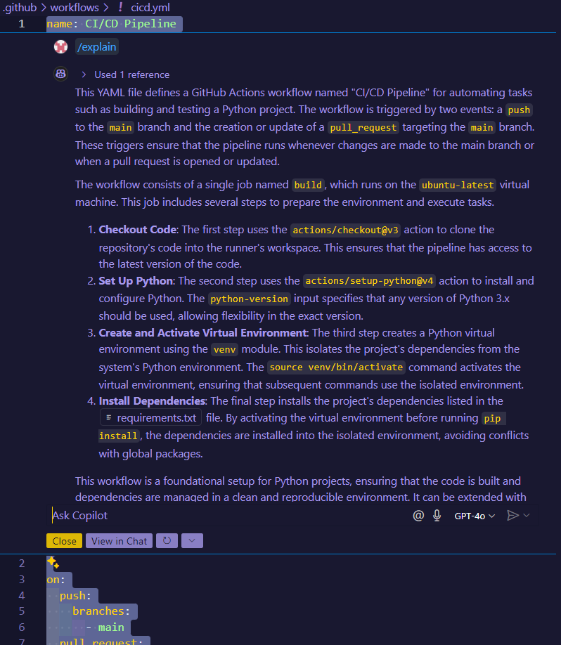

7. También puedes selleccionar las líneas o proción de código que quieras y la explicará con más detalle. Por ejemplo:

   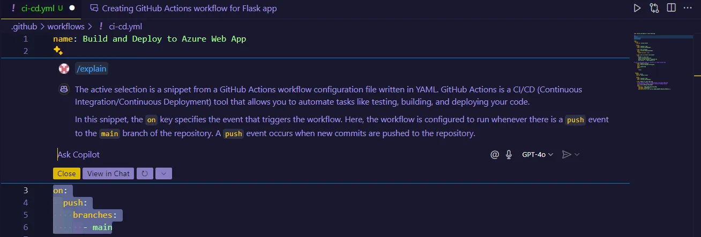

8.  Dado que la branch del trigger está puesta en main tengo que actualizar a mi rama actual para que se ejecute cuando realice algún cambio sobre esta rama. Entonces ingreso en el inline-chat (el código debe estar seleccionado):

      ```markdown
      /edit Update branch to feature/copilot-cicd
      ```


      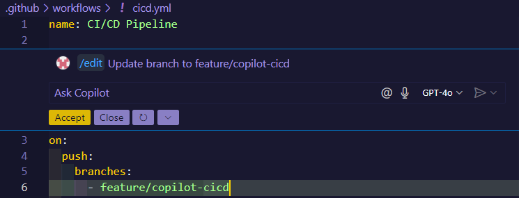

 9. Accept
  
 10. Podemos pedirle a Copilot que nos recomiende una versión para Python. Abre el Copilot chat e ingresa el siguiente mensaje:

      ```markdown
      @workspace Qué versión de python me recomiendas para este proyecto?
      ```
   
      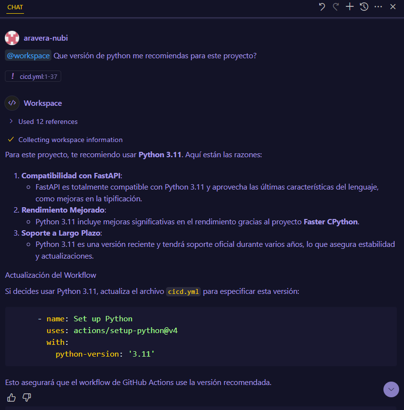  

 11. También podemos darle instrucciones a Copilot por medio de comentarios. por ejemplo:
      ```yml
      # "Create a step to upload an artifact named python-app using the current directory (.) as the path."
      ```
12. Preciona `Tab` para aceptar la sugerencia.
   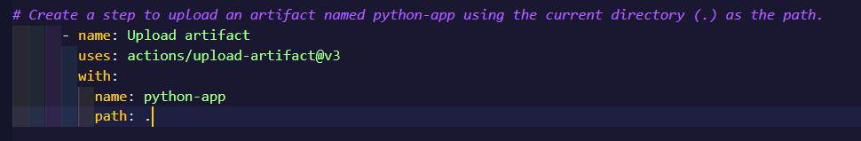

##  Paso 4:  Trigger Workflow y prueba de job "Build"
Ahora que tenemos el workflow de build creado, vamos a probarlo. 

1. En el panel izquiero de VS Code, selecciona la opción **Source Control** para hacer un commit y subir los cambios a la rama remota.

   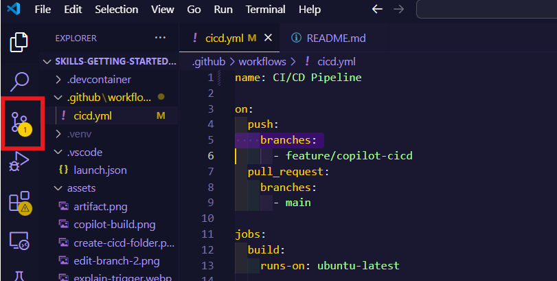

2. Add Stage changes “+”
3. Haz clic en el “Símbolo de estrellas” para generar un commit message con copilot.
4. Commit
5. Selecciona la opción **Sync Changes**
6. Luego de sincronizar los cambios en el remoto (push), dirígete a la pestaña **Actions** en el repositorio GitHub. Allí podrás ver el workflow que acabas de crear. Haz clic en él para abrirlo.
7. Hay un error en el job de build. Vamos a pedirle a Copilot que nos explique el error haciendo clic en el ícono "Explain error":

   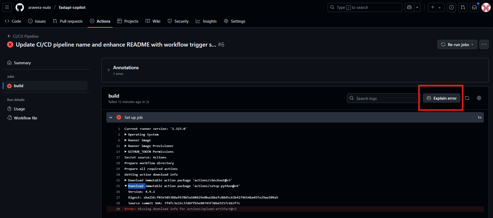
8. Una de las sugerencias de Copilot es revisar la versión de la acción, también nos provee un link a la documentación. Vamos a hacer clic en el link para ver si hay una versión más reciente de la acción.

   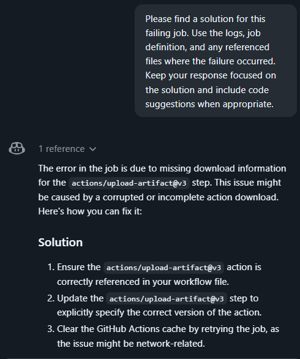
9. En la documentación de la acción, podemos ver que la versión más reciente es `v4`. 
10. Actualizamos la acción con esta nueva versión y triggereamos nuevamente el workflow.
11. Regresamos a la pestaña **Actions** en GitHub y verificamos que el job de build se haya ejecutado correctamente.


      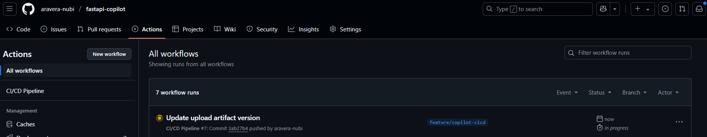

      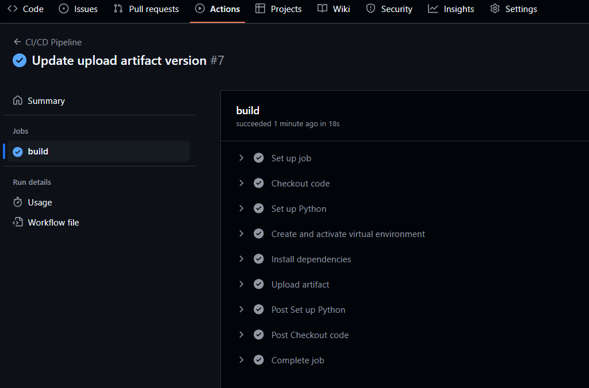

##  Paso 5: Crear un job de deploy

1. Abre el archuvo cicd.yml.
2. Posiciona el cursor en la última línea del archivo y presiona `Ctrl + I` (windows) o `Cmd + I` (mac) para abrir el **Copilot's Inline Chat**.
3. Escribe el siguiente mensaje para pedirle a Copilot que te ayude a crear un job de deploy:

   ```markdown
   Create a job to deploy the application to Azure App Service using the Azure Web Apps Deploy action. Don't forget download artifact from the previus job. Use a publish profile as authentication secret.
   ```


      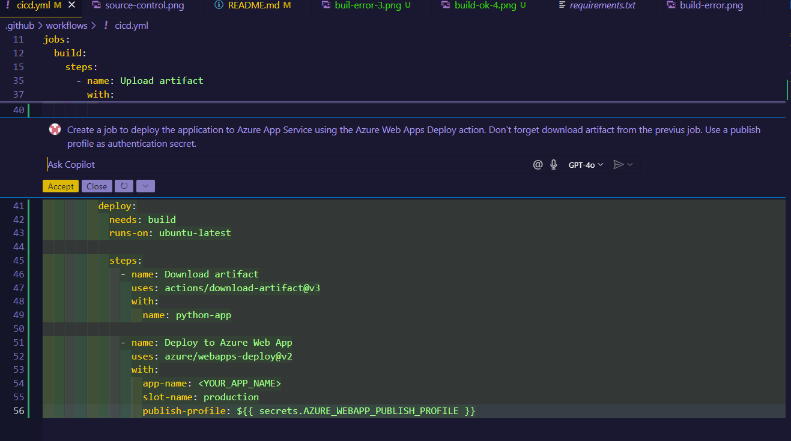
